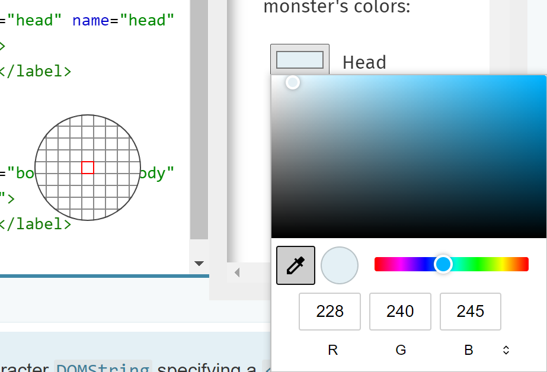

# EyeDropper API 
Authors: [Sidhika Tripathee](https://github.com/t-sitri), [McKinna Estridge](https://github.com/t-saestr), [Sammy Hannat](https://github.com/samhannat)

## Introduction
Currently on the web, creative application developers are unable to implement an eyedropper, a tool that allows users to select a color from the pixels on their screen, including the pixels rendered outside of the web page requesting the color data. This explainer proposes a web API that enables developers to use a browser-supplied eyedropper in the construction of custom color pickers. 

## Problem/Motivation
Several creative applications would like to utilize the ability to pick a color from pixels on the screen. Many cross-platform applications, e.g. Powerpoint, have eyedroppper functionality on their native app but are unable to carry it over the web.      
   
Even though some browsers have built-in eyedropper functionality into color input tags, this limits customizability and can be seen as being out of place for many applications. 

Currently, desktop and web versions of apps with eyedroppers have many different features which have shaped our solution. Features like the preview of a pixel color and adding eyedropper colors to a queue are specific features envisioned in the solution. See Appendix A to view an example of the preview feature inside of Figma, an image editing web application. See Appendix B to view an example of the color queue feature inside of Paint, a desktop image editing application. 

## Goals 
1. Provide access to the color values of one or more user-selected pixels, including pixels rendered by different origins, or outside of the browser.
2. Provide coordinate information in addition to a color value when the selected pixel is rendered by the same web application that created the instance of the eyedropper.
3. Allow the developer to enable and disable the eyedropper through script (subject to user activation).
4. Keep the user in control by providing the means to exit the eyedropper mode, for example, by pressing the ESC key.
5. Keep the user in control by requiring some explicit action, for example pressing a mouse button, to indicate which pixels will have color information returned to the web page.
6. Allow browser implementors the freedom to implement eyedropper pixel selection UI that best fits their platform and browser.  Note that a future version of the proposal may afford web developers more control over that UI.  One example supported by Chromium-based browsers is shown below.  


## Non-Goals
1. This proposal does not currently define an object model for a color, though it seems like something that would be a good addition to the web platform. 
1. This proposal does not currently define a mechanism to allow developers to hide or show the eyedropper's pixel selection UI while remaining in eyedropoper mode, but a future version may allow that, for example, to facilitate clicking on application UI elements instead of selecting a color value.

## Privacy
Exposing endpoints allowing developers to access unrestricted  pixel data from a user's machine presents security challenges. In particular any eyedropper implementation should not allow a web page to "screen scrape" information the user didn't intend to share with the web application, for example, while the user moves the mouse around the screen.

One way to mitigate this threat is to require that pixel data only be made available to the web application when the user takes some explicit action like depressing a mouse button.

Additionally, browsers should provide a clear indication as to when the user has been transitioned into an eyedropper mode and provide the means for the user to exit that mode, for example, by pressing an ESC key.

The transition into pixel selection mode should require user activation, for example, clicking on a button from the web page.  This helps avoid "stealing clicks" from the user that might lead to unintentionally revealing pixel data.

## Solution
The API will enable web developers to incorporate an eyedropper in their web applications. The eyedropper would allow the developer to access the hex value of a user specified pixel and its position.  

### Web IDL
```
[Exposed=Window]
interface ColorSelectEvent : Event {
  constructor();
 
  readonly attribute DOMString value;
  readonly attribute long screenX;
  readonly attribute long screenY;
};
 
/// @event name="colorselect", type="ColorSelectEvent"
/// @event name="close", type="Event"
[Exposed=Window]
interface EyeDropper : EventTarget {
  constructor();
 
  void open();
  void close();
 
  readonly attribute boolean open;
 
  // Event handler attributes
  attribute EventHandler oncolorselect;
  attribute EventHandler onclose;
};
```

## Example Usage
```javascript
// Create an EyeDropper object
let eyeDropper = new EyeDropper();

// Enter pixel select mode
let icon = document.getElementbyId("eyeDropperIcon")
icon.addEventListener('click', e => {
   eyeDropper.open();
});
 
eyeDropper.addEventListener('colorselect', e => {
    // returns hex color value and position of the pixel in screen coordinates
    console.log(`${e.screenX}, ${e.screenY}: ${e.value}`);

    // close the eyedropper explicitly if we only want the to select one color
    eyeDropper.close();
 });

eyeDropper.addEventListener("close", e => {
    // handle the user choosing to exit the pixel selection mode
})
 ```
 
## Appendix
### Appendix A: Pixel selection preview feature from Figma


### Appendix B: Microsoft Paint color picker

